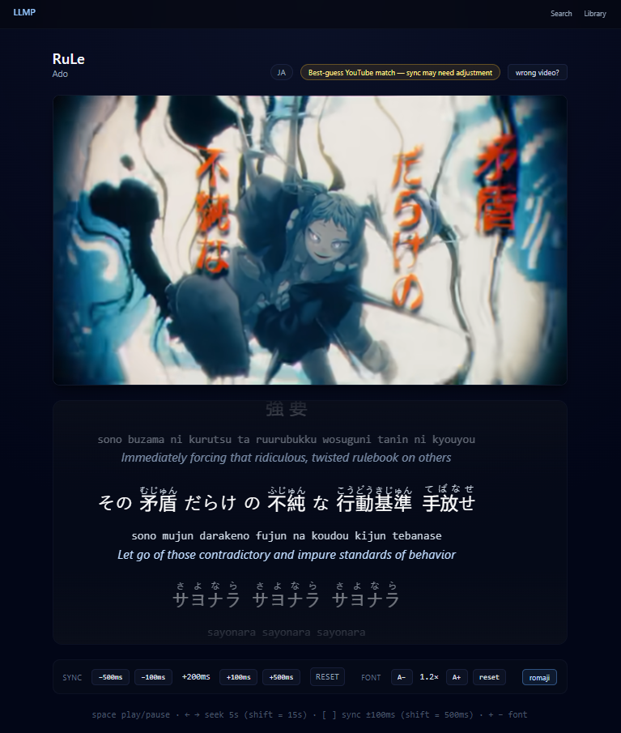
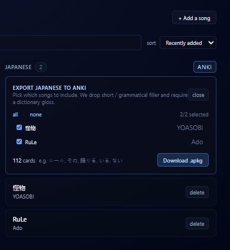
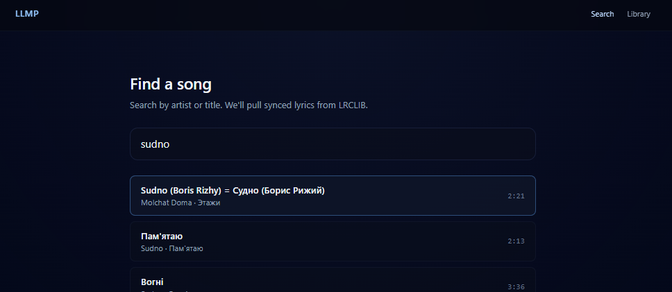

# LLMP

Language-Learning Music Player — turns songs into interactive language lessons.



Plays the YouTube audio, scrolls LRC-synced lyrics line by line, and stacks a
transliteration and English translation under each line. Hover any word for its
lemma, part of speech and definition, then export collected vocabulary as an
Anki deck.



Supports **Russian** and **Japanese**, with hiragana furigana rendered as ruby
above the kanji and an optional romaji tier.



> A personal project I started while learning Russian. I was tired of juggling between YouTube, a lyrics site, and a dictionary. LLMP folds all of it onto one screen so immersion practice becomes the path of least resistance. Japanese came next, for the same reason.

## Features
-   Synced playback — karaoke-style lyric scroll with the active line centered; per-song sync offset you can nudge live, remembered in the browser
-   Per-word lookups — hover or keyboard-focus any word for lemma, POS, grammar and definition (kaikki.org / Wiktionary)
-   Japanese furigana — hiragana readings as ruby above the kanji, with a toggleable romaji line
-   Line translations — English via DeepL (free tier); omit the key to disable
-   Anki export — download a `.apkg` deck of a song's most-used vocab, deduplicated and filtered; deterministic note IDs update existing cards on re-import instead of duplicating
-   Keyboard-first player — play/pause, seek, sync nudge and font scaling

## How it works
Adding a song kicks off a background ingestion pipeline:
```
LRCLIB search  →  synced .lrc lyrics  →  language auto-detected from the text
      →  YouTube video match (non-fatal if it fails)
      →  tokenize + lemmatize (per language)
      →  transliterate each line
      →  batch-translate lines via DeepL
      →  persist lines + tokens  →  status: ready
```
The client polls the song's status while this runs, then loads the player once
it's `ready`. Language is detected from the lyrics, not chosen by hand, and
drives every downstream step. Word definitions are resolved at read time by
joining tokens against a locally-loaded Wiktionary table, preferring a
part-of-speech match with an any-POS fallback.

## Stack
-   Backend — FastAPI + SQLAlchemy 2 + SQLite. Russian NLP via pymorphy3 + razdel (`transliterate`); Japanese via SudachiPy (`sudachidict_full`) + pykakasi
-   Frontend — React 18 + Vite + TypeScript + Tailwind + TanStack Query + React Router
-   External services — LRCLIB (lyrics, no auth), YouTube Data API v3, DeepL Free
-   Anki — `genanki` for `.apkg` generation with deterministic note IDs

## Requirements
-   Docker Engine + the `docker compose` plugin
-   Linux or WSL2 (Ubuntu)

## Setup
### 1. Create your `.env`
``` bash
cp .env.example .env
```
Set `YOUTUBE_API_KEY`. `DEEPL_API_KEY` is optional — leave it empty to skip translations.

------------------------------------------------------------------------
### 2. Download the Wiktionary dumps
Place the kaikki.org dumps into `backend/data/`:
-   Russian — https://kaikki.org/dictionary/Russian/ → `kaikki.org-dictionary-Russian.jsonl`
-   Japanese — https://kaikki.org/dictionary/Japanese/ → `kaikki.org-dictionary-Japanese.jsonl`

------------------------------------------------------------------------
### 3. Bring the stack up
``` bash
docker compose up --build
```

------------------------------------------------------------------------
### 4. Load the dictionary table(s)
Once per language, takes a few minutes:
``` bash
docker compose exec backend python -m scripts.build_dictionary --language ru
docker compose exec backend python -m scripts.build_dictionary --language ja
```

------------------------------------------------------------------------
### 5. Open the app
Frontend at:
    http://localhost:5173
API at http://localhost:8000, with interactive docs at http://localhost:8000/docs.

The SQLite database and dictionary dumps live under `backend/data/`, mounted as
a volume so they survive container restarts.

------------------------------------------------------------------------
### Native dev (no Docker)
``` bash
python3 -m venv .venv
source .venv/bin/activate
pip install -e ./backend[dev]
uvicorn app.main:app --reload --app-dir backend
```
In another terminal:
``` bash
cd frontend && npm install && npm run dev
```

## Configuration
Read from `.env` (see `.env.example`):

| Variable | Purpose |
|---|---|
| `YOUTUBE_API_KEY` | YouTube Data API v3 key, used to find the video for a song |
| `DEEPL_API_KEY` | DeepL Free key for line translations. Optional — omit to disable |
| `DATABASE_URL` | SQLAlchemy URL. Defaults to a local SQLite file; Docker points it at `backend/data/` |
| `CORS_ORIGINS` | JSON list of allowed frontend origins. Defaults to `http://localhost:5173` |

## Keyboard shortcuts
| Key | Action |
|---|---|
| `space` | play / pause |
| `← / →` | seek ±5s (hold `shift` for ±15s) |
| `[ / ]` | sync offset ±100ms (hold `shift` for ±500ms) |
| `+ / -` | lyric font scale up / down |